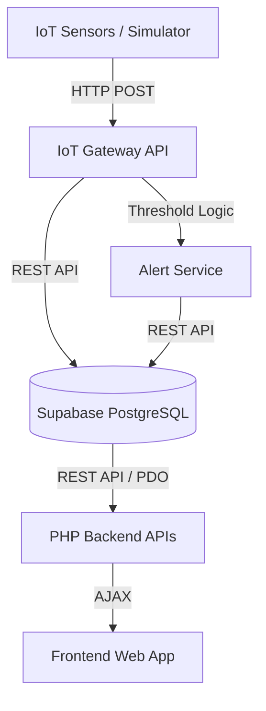

# System Architecture

## System Overview
FuelGuard is an automated, IoT-driven fuel siphoning detection and fleet management system. It aims to reduce fuel shrinkage in logistics fleets by moving from manual reconciliation to real-time monitoring. The system ingests telemetry data from ultrasonic sensors installed on truck fuel tanks, processes it to detect anomalies (like rapid fuel drops indicative of theft), and presents the data through a web-based dashboard used by fleet managers, owners, and drivers.

## Component Diagram

## Tech Stack
| Layer | Technology | Version |
|---|---|---|
| IoT Gateway | Python, FastAPI | 0.104.1 |
| Database | Supabase (PostgreSQL) | SaaS / REST v1 |
| Backend API | PHP | 8.x (assumed) |
| Frontend | HTML, CSS, JavaScript | Native |
| Simulator | Python | 3.x |

## Data Flow
1. **Ingestion**: An IoT sensor (or the `sensor_simulator.py` script) measures the raw distance from the top of the tank to the fuel surface and POSTs a JSON payload to the Gateway API (`/api/logs`).
2. **Processing**: The Gateway calculates the fuel volume and percentage based on tank dimensions. It also validates thresholds and temperature compensation.
3. **Detection**: If the fuel percentage drops below predefined thresholds (e.g., < 15%), an alert is generated.
4. **Storage**: Both the telemetry reading and any generated alerts are saved to Supabase via its REST API.
5. **Consumption**: The PHP backend endpoints query Supabase and serve the aggregated data and alerts to the HTML/JS frontend dashboards.

## Deployment Topology
The system currently implements a distributed microservice topology relying on a Backend-as-a-Service (BaaS) provider. 
- The **IoT Gateway** and **Simulator** run in Docker containers (via `docker-compose.yml`) alongside a Redis cache and InfluxDB (which appear to be legacy/alternative stores, though Supabase is the primary datastore).
- The **Frontend and PHP API** are likely served via a traditional web server (Apache/Nginx) configured for PHP.
- The **Database** is hosted on Supabase (cloud-hosted PostgreSQL).

## Key Design Decisions
- **REST over MQTT**: Telemetry data is sent via HTTP POST instead of MQTT, which is unusual for high-frequency IoT but simplifies the stack.
- **Supabase as Primary DB**: The system leverages Supabase's REST interface directly from the Python Gateway and PHP backend, sidestepping the need for complex ORM configurations. ⚠️ `config/database.py` contains a local MySQL connection string which appears unused, indicating a pivot to Supabase during development.